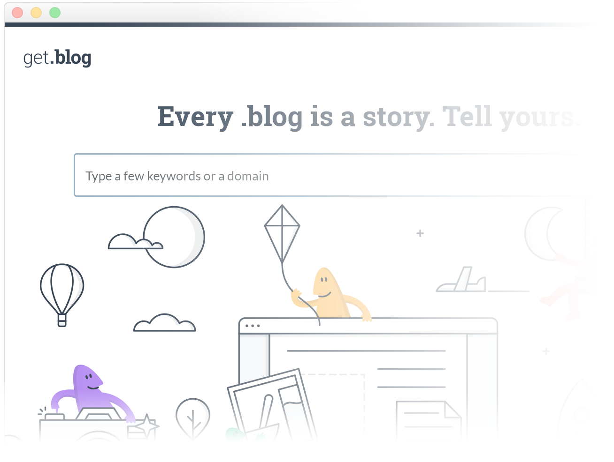

# Delphin

Delphin was the [get.blog](https://get.blog/) front-end – a place where you could register a .blog domain in the easiest way.

### Delphin has reached its goals and allowed us to launch .blog successfully, but it's been since sunset. As such this repository has been [archived](https://help.github.com/en/articles/archiving-a-github-repository) - it's no longer actively maintained, the repository is read-only, but you can still fork it! 

It’s built with JavaScript – a very light [Node.js](https://nodejs.org) server, [React.js](https://facebook.github.io/react/), [Redux](http://redux.js.org/), [Webpack](https://webpack.js.org/), and many other wonderful libraries.

## Getting started

1. Make sure you have [`git`](https://git-scm.com/book/en/v2/Getting-Started-Installing-Git), [`node`](https://nodejs.org/en/download/package-manager/), [`npm`](https://docs.npmjs.com/getting-started/installing-node), and [`yarn`](https://yarnpkg.com/en/docs/install) installed
2. Clone this repository locally with `git@github.com:Automattic/delphin.git`
3. Execute `yarn start` to install packages and start the server
4. Add `127.0.0.1 delphin.localhost` to your `hosts` file
5. Open http://delphin.localhost:1337 in your browser

Alternatively, you can use [Delphin Bootstrap](https://github.com/Automattic/delphin-bootstrap) to set up a virtual machine with a Delphin development environment for you.

## Testing

You can execute the test suite with `yarn test`.

Code in folders named `lib` or `reducers` should have unit tests. Moreover, these tests should live in a subdirectory inside the corresponding module named `tests`. We use [Jest](https://facebook.github.io/jest/) for writing tests and encourage [test-driven development](https://en.wikipedia.org/wiki/Test-driven_development) (TDD).

You can execute an individual test with e.g. `yarn test app/reducers/ui/domain-search/tests`.

## Coding Guidelines

Delphin follows [Calypso's guidelines](https://github.com/Automattic/wp-calypso/blob/master/docs/coding-guidelines.md).

## Browser Support

We support the latest two versions of all major browsers, except IE, where we currently only support 11 and Edge (see [Browse Happy](http://browsehappy.com) for current latest versions).

## License

Delphin is licensed under [GNU General Public License v2 (or later)](./LICENSE.md).
